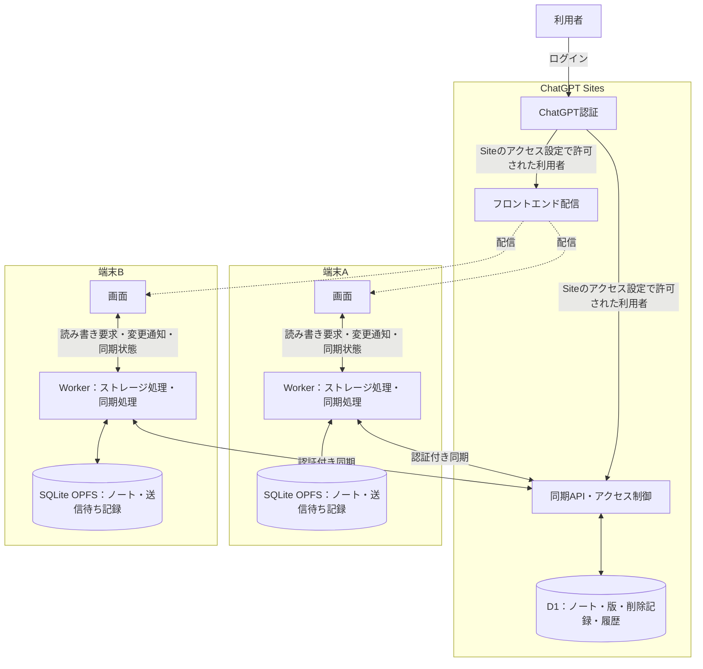
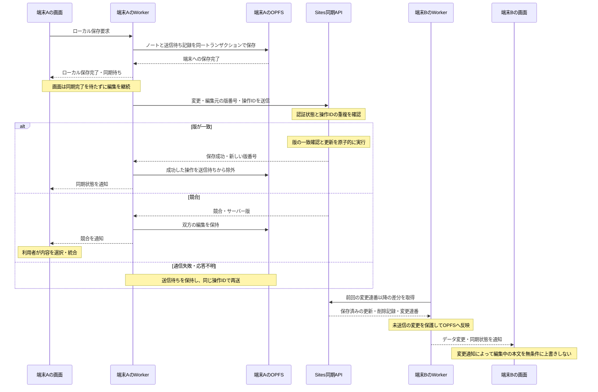

# Cloud Sync

- SQLite OPFSをローカルの作業用DBとし、ノートと未送信の変更を保持する。
- 端末への保存とクラウドへの同期を区別して表示し、誤編集・誤削除から復元できる履歴を保存する。

## 対象範囲

Cloud Syncは、Siteのアクセス設定で許可された利用者が同じノート空間を利用する単一データ領域モデルとする。利用者ごとのデータ分離、権限分け、リアルタイム共同編集は対象外とする。公開Siteは採用しない。

ChatGPT Sitesの前提は [[ChatGPT Sites]]、同期APIの入出力、エラー、入力制約、D1スキーマは [[Cloud Sync API]] に記載する。今後の対応範囲は [[planty-wiki scope]] に記載する。

## 認証とアクセス制御

- フロントエンドと同期APIは、同じChatGPT Sitesのサイトから配信する。
- Siteのアクセス設定を同期APIの認可境界とし、許可された認証済み利用者だけがアクセスできるようにする。
- Siteへのアクセスを許可された利用者は区別せず、メールアドレスの許可リストも使用しない。D1はSite単位の共有データ領域とし、利用者識別用の列を持たせない。

## 全体構成

各端末のOPFSは独立した作業用DBである。

## 保存・同期の流れ

ログイン済みの端末での通常更新を示す。同期API内のD1アクセスは省略する。

## 同期処理

- 同期処理は画面から独立したWorker内のモジュールが担当する。初期版ではストレージ処理と同じWorkerに配置し、OPFSへのアクセス窓口を一本化する。
- 画面はローカルの読み書きを要求し、Workerからデータ変更・同期状態・競合の通知を受ける。通信と再送はWorkerの責務とし、画面の再描画やノート切り替えで同期処理を作り直さない。
- バックグラウンド同期の対象はアプリ起動中とする。ページ終了後やブラウザによる休止中の継続実行は保証対象外とする。次回起動・復帰時にOPFSの送信待ち記録から再開する。
- 同期単位はノートとする。送信内容はMarkdown本文、パス、タイトル、削除状態とする。検索・バックリンク用データは各端末で再構築する。
- OPFSへのノート保存と送信待ち記録の追加は、同じトランザクションで行う。サーバーの保存成功を確認するまで未送信の変更を保持する。
- 同期契機はログイン後、ローカル保存後、通信復帰時、画面復帰時とする。アプリ側からWorkerへログイン・通信復帰・画面復帰を通知する。画面表示中はWorkerが30秒間隔でも確認する。
- 再送には同じ操作IDを使い、サーバー側で重複適用を防ぐ。通信失敗時は再試行間隔を延ばし、認証切れの場合は再ログインまで同期を停止する。
- 他端末の変更はサーバーの変更連番を基準に差分取得する。受信時も未送信の変更や編集中の本文を無条件に上書きしない。
- OPFSの共有範囲とログアウト後の扱いは [[planty-wiki local storage]] に従う。

## 版管理と競合解決

- ノートには名前変更でも変わらないUUIDを付与する。端末間でのパス重複は競合として扱う。
- 更新には編集元のサーバー版番号を添付する。サーバー側で版の一致確認と更新を原子的に行い、古い版からの更新を競合として返す。
- フォルダーインポート時は、パスが一致するノートについて、最新の同期済み版本文を基準にインポート内容とローカルの変更を三者マージする。基準版がない場合またはマージできない場合は、双方を保持して競合として扱う。
- 競合時はサーバー版とローカル版を両方保持し、利用者が内容を選択・統合する。通常の同期では、更新日時による自動上書きと本文の自動マージは行わない。
- 削除は版番号を持つ削除記録として同期する。初期版では削除記録を保持し、古い端末からの復活を防ぐ。
- 復元対象はサーバーに保存済みの過去の版とする。初期版では過去の版を自動削除せず、復元内容を新しい版として保存する。

## 未決定事項

- 対応するスマートフォンのOS・ブラウザは未決定とする。初回起動にはネットワーク接続を必要とするが、初回起動完了後のオフライン起動とローカル利用は対象とする。
- 履歴の保持上限は、実際の保存容量と利用制限の確認後に決定する。
