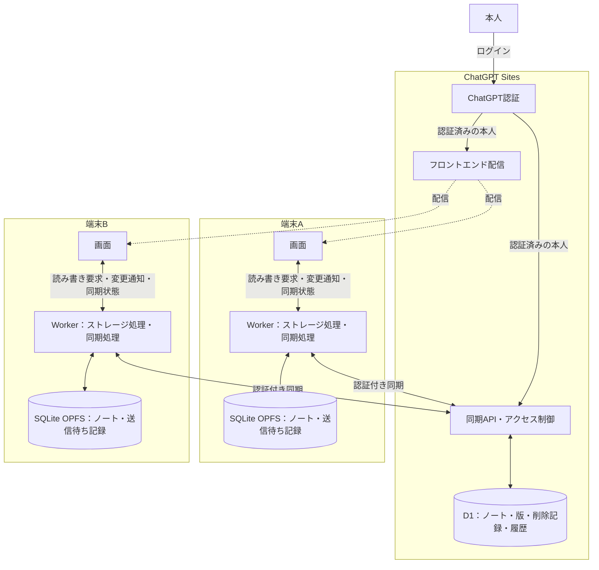
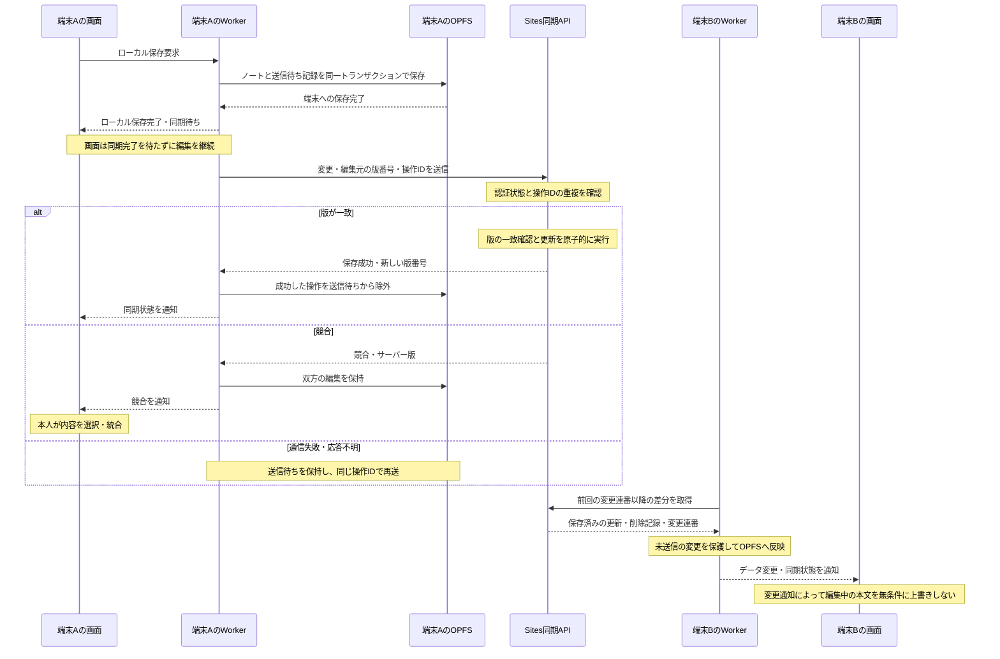

# Functional Requirements

## Overview

- Tech stack: TypeScript + Preact + Vite + Lexical + SQLite WASM on OPFS.
- Use English for UI labels, placeholders, status messages, and notifications shown to users.
- Display and routing:
    - Route with `/pages/[URL-encoded markdown file name]`.
    - Create an empty page when routing to a missing page so users can start writing.
    - Open the SQL query page at `/tools/query` and display SELECT or WITH results in a table.

## Runtime Environment

- Supported browser: Chrome>=142.
    - Treat other browsers as unverified.
- Do not support incognito or guest mode because data disappears on browser exit.
- Use a single browser because automatic sync across browsers is not possible.
- Serve over HTTPS or localhost to enable OPFS.

## Storage and Sync

- Validate and insert import or bulk-save input records one by one.
    - Fail the entire transaction when an invalid record is found so invalid data never enters the DB.
- Show a confirmation dialog or an undo bar in delete UIs so data is not removed immediately by mistake.
- Keep a failed diff instead of discarding it so it can be saved again after recovery.
- Store data in SQLite WASM as an intermediate table and read and write there in normal operations.
- Provide a feature that imports Markdown from a user-selected local directory.
- Clear the existing SQLite database and overwrite it with the imported content when importing from a Markdown folder.
- Auto-save and apply changes to SQLite when input pauses for a few seconds during editing.
- Run Markdown export only when the Export button is pressed, and do not run it during normal auto-save.
- Ignore the file side on conflicts after import and overwrite with the DB by re-exporting.
- UIから参照していないDBテーブルやデータ構造は維持せず、不要になった時点で削除して責務をシンプルにする

## Planned Requirements: Cloud Sync

- SQLite OPFSをローカルの作業用DBとし、ノートと未送信の変更を保持する。
- 端末への保存とクラウドへの同期を区別して表示し、誤編集・誤削除から復元できる履歴を保存する。

### 認証とアクセス制御

- フロントエンドと同期APIは、同じChatGPT Sitesのサイトから配信する。
- ChatGPT Sitesの認証とD1を利用し、同じアカウントで複数端末からノートを閲覧・編集できるようにする。
- フロントエンドと同期APIには、認証済みの本人だけがアクセスできる。
- 利用者は本人だけとする。対象は本人の端末間同期とし、共有編集とリアルタイム共同編集は対象外とする。

### 全体構成

各端末のOPFSは独立した作業用DBである。

### 保存・同期の流れ

ログイン済みの端末での通常更新を示す。同期API内のD1アクセスは省略する。

### 同期処理

- 同期処理は画面から独立したWorker内のモジュールが担当する。初期版ではストレージ処理と同じWorkerに配置し、OPFSへのアクセス窓口を一本化する。
- 画面はローカルの読み書きを要求し、Workerからデータ変更・同期状態・競合の通知を受ける。通信と再送はWorkerの責務とし、画面の再描画やノート切り替えで同期処理を作り直さない。
- バックグラウンド同期の対象はアプリ起動中とする。ページ終了後やブラウザによる休止中の継続実行は保証対象外とする。次回起動・復帰時にOPFSの送信待ち記録から再開する。
- 同期単位はノートとする。送信内容はMarkdown本文、パス、タイトル、削除状態とする。検索・バックリンク用データは各端末で再構築する。
- OPFSへのノート保存と送信待ち記録の追加は、同じトランザクションで行う。サーバーの保存成功を確認するまで未送信の変更を保持する。
- 同期契機はログイン後、ローカル保存後、通信復帰時、画面復帰時とする。アプリ側からWorkerへログイン・通信復帰・画面復帰を通知する。画面表示中はWorkerが30秒間隔でも確認する。
- 再送には同じ操作IDを使い、サーバー側で重複適用を防ぐ。通信失敗時は再試行間隔を延ばし、認証切れの場合は再ログインまで同期を停止する。
- 他端末の変更はサーバーの変更連番を基準に差分取得する。受信時も未送信の変更や編集中の本文を無条件に上書きしない。
- ログアウト時は同期を停止し、未送信の変更は元のアカウント専用領域に保持する。

### 版管理と競合解決

- ノートには名前変更でも変わらないUUIDを付与する。端末間でのパス重複は競合として扱う。
- 更新には編集元のサーバー版番号を添付する。サーバー側で版の一致確認と更新を原子的に行い、古い版からの更新を競合として返す。
- フォルダーインポート時は、パスが一致するノートについて、最新の同期済み版本文を基準にインポート内容とローカルの変更を三者マージする。基準版がない場合またはマージできない場合は、双方を保持して競合として扱う。
- 競合時はサーバー版とローカル版を両方保持し、本人が内容を選択・統合する。通常の同期では、更新日時による自動上書きと本文の自動マージは行わない。
- 削除は版番号を持つ削除記録として同期する。初期版では削除記録を保持し、古い端末からの復活を防ぐ。
- 復元対象はサーバーに保存済みの過去の版とする。初期版では過去の版を自動削除せず、復元内容を新しい版として保存する。

### 実装時の検証事項・未決定事項

- Sites上での現行OPFSとログインの動作確認は、実装時の検証項目とする。
- 対応するスマートフォンのOS・ブラウザは未決定とする。完全なオフライン起動は、今回の同期要件の対象外とする。
- 履歴の保持上限は、実際の保存容量と利用制限の確認後に決定する。

## Markdown

- Support wiki links in the `[[Page]]` format, emphasize them in the body, and open the page on click.
- Do not support image embed syntax (``), and store it as plain text.
    - Keep accepting `![...]` as a literal string for now, although image embeds may be supported later.
- Avoid custom Markdown extensions to maximize portability.
- See [[planty-wiki markdown syntax]] for details.

## Markdown Editor

- 検索やAPI呼び出しを伴うテキスト入力は300ms程度デバウンスする
    - リクエストIDなどで最新レスポンスのみをUIへ反映して結果の取り違えを防ぐようにする
- Tabキーの挙動はLexicalのTabIndentationPluginなど既定のインデント/アウトデントロジックを使う
    - カスタムプラグインでスペース挿入に置き換えないようにする
- Markdownのリストインデントは4スペースを前提とし、2スペース記法はサポート対象外とする。Tab入力やImport時も同ルールを徹底する
- Markdown文字列からの再インポートはノート切り替え時のみ行い、同じノートのautosaveではEditorStateを上書きせずキャレット位置を保持する

## Web Application

- フォームや検索入力ではplaceholderだけに頼らず、必ずlabelやaria-labelでスクリーンリーダーに説明を伝えるようにする
- ストレージやネットワークへの初期化処理では例外が発生してもUI全体が空白にならないようにtry/catchでフォールバックを実装するようにする
- バックリンク生成やノート一覧の描画など件数が増える処理は、全件スキャンやDOM全描画を続けずに早期に仮想リスト化やSQLiteインデックスを導入してメインスレッドをブロックしないようにする
- バックリンクやWikiリンクの参照関係はSQLiteのlinksテーブルなど補助構造に永続化し、UIはlistBacklinks等のストレージAPI経由で取得するようにして全件走査を避けること
- ディレクトリインポートやワーカー越しのストレージ操作など長時間処理には並列数の制御・深さ/件数上限・キャンセルプロトコルを必ず設計し、ブラウザをフリーズさせないようにする

## Web Security

- window.location.hashなどブラウザのロケーションAPIへユーザー入力を流すときは、`/pages/`などプレフィックスのスラッシュは保ったまま各セグメント単位でencodeURIComponentを適用してパストラバーサルやXSSを防止すること
- Wikiリンクや入力パスを扱う際はnormalizePath相当のロジックで`.`や`..`を解決し、常にルート起点の安全なパスだけを保存・遷移させること
- 外部ソース（Markdown importなど）から取り込むパスも必ずnormalizePath経由で検証し、危険な相対パスや制御文字を弾くこと

## Distribution

- Use ChatGPT Sites for hosting.
- Bundle Markdown under `docs/` into the app and show it as `/pages/...`.
    - Treat bundled docs as the source of truth and prefer the bundled body over DB content when opening the same `/pages/...` path.
    - Create a missing bundled docs page with the bundled body on open instead of an empty body.
- Place official SQLite WASM artifacts directly under `/public/sqlite3.{js,wasm}` and distribute them with `sqlite-opfs-worker.js` and `sqlite3-opfs-async-proxy.js`.
    - sqlite3 WebAssembly & JavaScript Documentation Index https://sqlite.org/wasm/doc/trunk/index.md
- Do not support images or attachments at this time.
- Do not provide full-app installation or offline cache.
